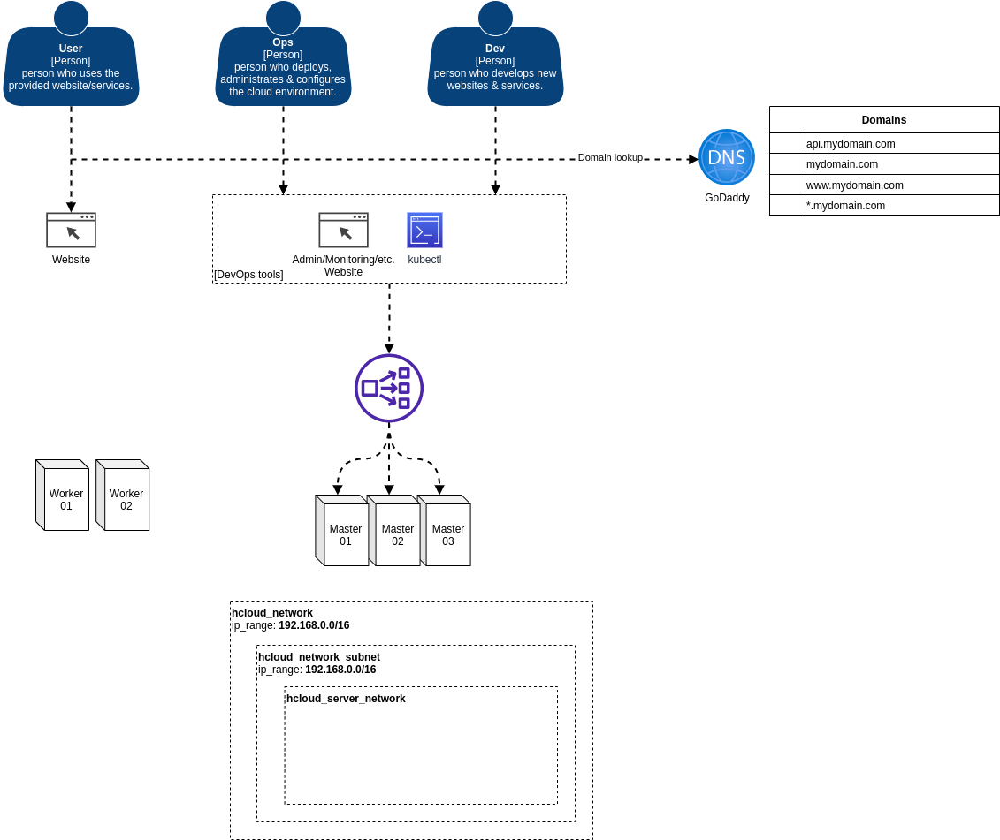

# Cloud testbed

This project is used to try out and experiment with different cloud tech stacks, tools and frameworks.

## Key goals

- as fast as possible to create & destroy
- fairly cheap
- easy to modify & extend
- as little requirements needed as possible

## Tech stack

- GitHub
- Terraform
- Hetzner Cloud
- Kubermatic KubeOne
- GoDaddy-DNS

## Cloud provider

I have decided to use Hetzner Cloud because of a few reasons:

1. Datacenter location - near where I live, so should be faster
2. Price - very good prices in comparison to AWS/Azure/GCE/DigitalOcean
3. API - has one in comparison to other providers (except of cause the large ones)
4. Support - suppport in tools/frameworks increases quite a lot

### Hetzner cloud prices

prices from Feb. 2022

List of VMs I think don't suite my needs (performance/price/preference/etc.)

| VM     | €/hour | €/month | vCPU | GB RAM | GB DISK |
|--------|--------|---------|------|--------|---------|
| CX11   | 0.007  |  4.15   |  1   |  2     |  20     |
| CX31   | 0.017  | 10.59   |  2   |  8     |  80     |
| CX41   | 0.031  | 18.92   |  4   | 16     | 160     |
| CX51   | 0.060  | 35.58   |  8   | 32     | 240     |
| CPX51  | 0.095  | 59.38   | 16   | 32     | 360     |

List of VMs which I think are the best fit

| VM     | €/hour | €/month | vCPU | GB RAM | GB DISK |
|--------|--------|---------|------|--------|---------|
| CPX11  | 0.008  |  4.75   |  2   |  2     |  40     |
| CX21   | 0.010  |  5.83   |  2   |  4     |  40     |
| CPX21  | 0.013  |  8.21   |  3   |  4     |  80     |
| CPX31  | 0.024  | 14.76   |  4   |  8     | 160     |
| CPX41  | 0.045  | 27.25   |  8   | 16     | 240     |

## Kubernetes deployment

I can remember a few month back that it was quite tiresome to setup a kubernetes
cluster fully automated with kubeadm and that some things didn't work out as I 
wanted. One example was, that I used terraform and a few bash scripts to deploy 
a complete cluster, but sometimes the initialization of the cluster network did 
break and I had to do manually.

After some research I ruled out some providers and decided to use 
**Kubermatic KubeOne**, because it supports Hetzner Cloud, is Open Source and fits 
most my needs.

## Infrastructure setup

## Securing secrets

I will use age & sops for encrypting secrets.

Ensure that the private key is not stored in the repo
`echo "key.txt" >> .gitignore`

Generate the key
`./bin/age-keygen -o key.txt`

